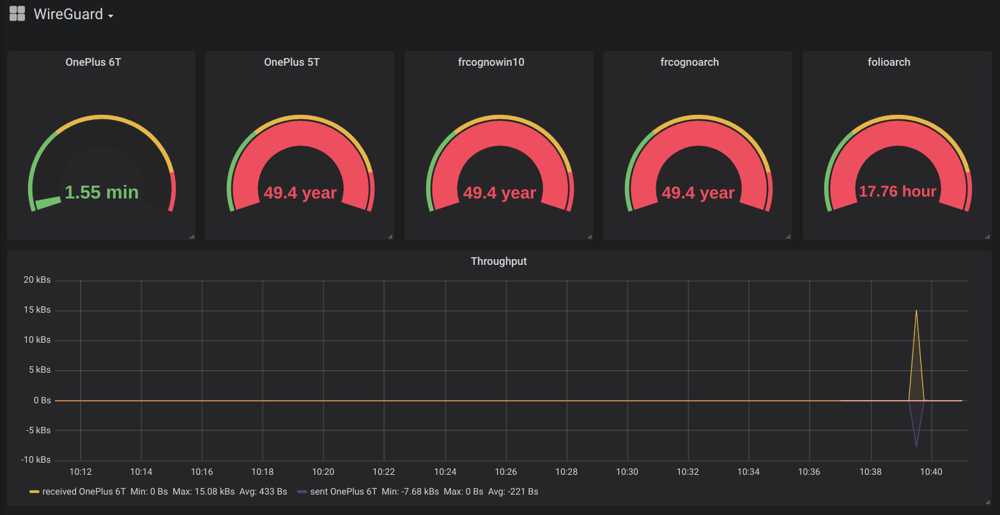

# Prometheus WireGuard Exporter

[](LICENSE) 

[](https://crates.io/crates/prometheus_wireguard_exporter) [](https://crates.io/crates/prometheus_wireguard_exporter) [](https://crates.io/crates/prometheus_wireguard_exporter)

[](https://github.com/MindFlavor/prometheus_wireguard_exporter/tree/3.6.1)
[](https://github.com/MindFlavor/prometheus_wireguard_exporter/tree/3.6.1)

[](https://github.com/mindflavor/prometheus_wireguard_exporter/actions?query=workflow%3ARust)
[](https://img.shields.io/github/commits-since/mindflavor/prometheus_wireguard_exporter/3.6.1)

[](https://github.com/qdm12/godevcontainer/actions/workflows/docker.yml)

[](https://hub.docker.com/r/mindflavor/prometheus-wireguard-exporter)

## Intro

A Prometheus exporter for [WireGuard](https://www.wireguard.com), written in Rust. This tool exports the `wg show all dump` (or `wg show <interface> dump` if you specify a config file) results in a format that [Prometheus](https://prometheus.io/) can understand. The exporter is very light on your server resources, both in terms of memory and CPU usage. It's also built for Docker for the following CPU architectures: `amd64`, `386`, `arm64`, `armv7` and `armv6`.



## Changelog

* From release [3.6.1](https://github.com/MindFlavor/prometheus_wireguard_exporter/releases/tag/3.6.1) the exporter correctly escapes the double quotes in `friendly_name`. Thanks to [Steven Wood](https://github.com/stvnw) for finding the bug in #82.
* **BREAKING** From version `3.6.0` the exporter takes fallback configuration values from the environment variables. Thanks to [j_r0dd](https://github.com/jr0dd) for the idea. This changes how the exporter evaluates the command line parameters: make sure to consult the documentation on how to convert your command line to the new format. Basically every switch (for example verbose `-v`) not expect values, either `true` or `false`. This is necessary because there is no way to discriminate between an empty environment variable and one that has not been set.
* From release [3.5.1](https://github.com/MindFlavor/prometheus_wireguard_exporter/releases/tag/3.5.1) the exporter supports multiple peer files. Thanks to [Tobias Krischer](https://github.com/tobikris) for the idea.
* From release [3.5.0](https://github.com/MindFlavor/prometheus_wireguard_exporter/releases/tag/3.5.0) the exporter supports the `friendly_json` tag. Entries prepended with the `friendly_json` tag will output all the entries in the specificed json as Prometheus attributes. Thanks to [DrProxyProSupport](https://github.com/iqdoctor) for the idea.
* From release [3.4.1](https://github.com/MindFlavor/prometheus_wireguard_exporter/releases/tag/3.4.0) the exporter supports prepending `sudo` to the `wg` command. This allows to run the exporter as a non root user (although sudoer without password). Thanks to [Jonas Seydel](https://github.com/Thor77) for the idea.
* **BREAKING** From release [3.4.0](https://github.com/MindFlavor/prometheus_wireguard_exporter/releases/tag/3.4.0) the exporter requires you to specify the friendly names in a specific format (only if you want to use them of course). This allows you to use arbitrary comments in the file while keeping the friendly name functionality. Thank you [Miloš Bunčić](https://github.com/psyhomb) for this. This also paves the way for future metadata. In order to migrate you can use this sed command: `sed -i  's/#/# friendly_name=/' peers.conf`. Please make sure to do a backup before using it!
* From release [3.3.1](https://github.com/MindFlavor/prometheus_wireguard_exporter/releases/tag/3.3.1) the exporter accepts multiple interfaces in the command line options. Just pass the `-i` parameter multiple times. Note the not specifying the interface is equivalent to specifying every one of them (the exporter will pass the `all` parameter to `wg show` command).
* **BREAKING** Starting from release [3.3.0](https://github.com/MindFlavor/prometheus_wireguard_exporter/releases/tag/3.3.0) the exporter allows you to specify a different interface from the file name. Previously if you specified the file name (the `-n` flag) the program would infer the interface name from the file name. Now the two items are decoupled: you need to specify the file name (with `-n`) and the interface name (with `-i`) separately. Thank you [Vincent Debergue](https://github.com/vdebergue) for helping with this (see issue [#22](https://github.com/MindFlavor/prometheus_wireguard_exporter/issues/22)). Upgrading from [3.2.4](https://github.com/MindFlavor/prometheus_wireguard_exporter/releases/tag/3.2.4): Please note that the `-n` flag no longer infer automatically the interface name from the file name. We now have the `-i` parameter for that. In order to keep the previous behaviour (if you use the `-n` flag) please add the `-i` flag to the command line arguments as well. For example, if you had `prometheus_wireguard_exporter -n /etc/wireguard/wg0.conf` you must specify `prometheus_wireguard_exporter -n /etc/wireguard/wg0.conf -i wg0` to keep the same behaviour.
* From release [3.0.0](https://github.com/MindFlavor/prometheus_wireguard_exporter/releases/tag/3.0.0) the exporter allows two label modes: one is to dump every allowed ip in a single label (called `allowed_ips`) along with their subnets. The second one is to create a pair of labels for each allowed ip/subnet pair (called `allowed_ip_0`/`allowed_subnet_0`, `allowed_ip_1`/`allowed_subnet_1` and so on for every allowed ip). The default if the single label mode but you can enable the second mode by specifying the `-s` switch at startup. Thank you [Toon Schoenmakers](https://github.com/schoentoon) for this solution (see issue [#8](https://github.com/MindFlavor/prometheus_wireguard_exporter/issues/8)).
* Starting from release [2.0.2](https://github.com/MindFlavor/prometheus_wireguard_exporter/releases/tag/2.0.2) this exporter supports IPv6 addresses too (thanks to [Maximilian Bosch](https://github.com/Ma27)'s PR [#5](https://github.com/MindFlavor/prometheus_wireguard_exporter/pull/5)).

## Setup

### Pre-built binaries

Coming soon, subcribe to [#59](https://github.com/MindFlavor/prometheus_wireguard_exporter/issues/59)

### Docker

1. You need Docker installed
1. You need [WireGuard](https://www.wireguard.com) installed in your host kernel
1. You need some Wireguard interfaces running
1. Download and run the container with:

    ```sh
    docker run -d --net=host --cap-add=NET_ADMIN --name wgexporter mindflavor/prometheus-wireguard-exporter
    ```

    ⚠️ If you encounter time issues on your 32 bit operating system, [check this](https://wiki.alpinelinux.org/wiki/Release_Notes_for_Alpine_3.13.0#time64_requirements)

1. Check it's up by visiting [http://localhost:9586/metrics](http://localhost:9586/metrics)

You can then update the image with

```sh
docker pull mindflavor/prometheus_wireguard_exporter
```

Or use a [tagged image](https://hub.docker.com/r/mindflavor/prometheus-wireguard-exporter/tags) such as `:3.5.1`.

If your host has an `amd64` or `686` CPU, you can also build the Docker image from source (you need `git`) with:

```sh
docker build -t mindflavor/prometheus_wireguard_exporter https://github.com/MindFlavor/prometheus_wireguard_exporter.git#master
```

### Build from source

1. You need [Rust](https://www.rust-lang.org/tools/install) installed
1. You need [WireGuard](https://www.wireguard.com) installed on your host
1. You need `wg` accessible in your path. The tool will call `wg show <interface(s)>|all dump` and of course will fail if the `wg` executable is not found.
1. You need some Wireguard interfaces running
1. You need `git` installed
1. Clone the repository with

    ```sh
    git clone https://github.com/MindFlavor/prometheus_wireguard_exporter.git
    cd prometheus_wireguard_exporter
    ```

1. Compile the program with

    ```sh
    cargo install --path .
    ```

    💁 If you encounter errors, please try updating your rust installation with `rustup update`.
    The code should compile with any relatively recent, 2018-compliant rustc version.
    As a frame of reference, the last release was built using the Rust Docker image using `rustc 1.53.0 (53cb7b09b 2021-06-17)`.

1. Run the program

    ```sh
    ./prometheus_wireguard_exporter
    ```

1. Check it's up by visiting [http://localhost:9586/metrics](http://localhost:9586/metrics)

## Usage

### Flags available

Start the binary with `-h` to get the complete syntax. The parameters are:

| Parameter | Env | Mandatory | Valid values | Default | Accepts multiple occurrences? | Description |
| -- | -- | -- | -- | -- | -- | -- |
| `-v` | `PROMETHEUS_WIREGUARD_EXPORTER_VERBOSE_ENABLED` | No | `true` or `false` | `false` | No | Enable verbose mode.
| `-a` | `PROMETHEUS_WIREGUARD_EXPORTER_PREPEND_SUDO_ENABLED` | No | `true` or `false` | `false` | No | Prepends sudo to `wg` commands.
| `-l` | `PROMETHEUS_WIREGUARD_EXPORTER_ADDRESS` | No | Any valid IP address | `0.0.0.0` | No | Specify the service address. This is the address your Prometheus instance should point to.
| `-p` | `PROMETHEUS_WIREGUARD_EXPORTER_PORT` | No | Any valid port number | `9586` | No | Specify the service port. This is the port your Prometheus instance should point to.
| `-n` | `PROMETHEUS_WIREGUARD_EXPORTER_CONFIG_FILE_NAMES` | No | Path to the wireguard configuration file | | Yes | This flag adds the *friendly_name* attribute or the *friendly_json* attributes to the exported entries. See [Friendly tags](#friendly-tags) for more details. Multiple files are allowed (they will be merged as a single file in memory so avoid duplicates).
| `-s` | `PROMETHEUS_WIREGUARD_EXPORTER_SEPARATE_ALLOWED_IPS_ENABLED` | No | `true` or `false` | `false` | No | Enable the allowed ip + subnet split mode for the labels.
| `-r` | `PROMETHEUS_WIREGUARD_EXPORTER_EXPORT_REMOTE_IP_AND_PORT_ENABLED` | No | `true` or `false` | `false` | No | Exports peer's remote ip and port as labels (if available).
| `-i` | `PROMETHEUS_WIREGUARD_EXPORTER_INTERFACES` | No | Your interface name(s) | `all` | Yes | Specifies the interface(s) passed to the `wg show <interface> dump` parameter. Multiple parameters are allowed.

Keep in mind that command line values take precedence over environment variables.

Once started, the tool will listen on the specified port (or the default one, 9586, if not specified) and return a Prometheus valid response at the url `/metrics`. So to check if the tool is working properly simply browse the `http://localhost:9586/metrics` (or whichever port you choose).

### Friendly Tags

Starting from version 3.5 you can instruct the exporter to append a *friendly name* or a *friendly_json* to the exported entries. This can make the output more understandable than using the public keys. For example this is the standard output:

```ebnf
# HELP wireguard_sent_bytes_total Bytes sent to the peer
# TYPE wireguard_sent_bytes_total counter
wireguard_sent_bytes_total{interface="wg0",public_key="2S7mA0vEMethCNQrJpJKE81/JmhgtB+tHHLYQhgM6kk=",allowed_ips="10.70.0.2/32,10.70.0.66/32"} 3208804
wireguard_sent_bytes_total{interface="wg0",public_key="qnoxQoQI8KKMupLnSSureORV0wMmH7JryZNsmGVISzU=",allowed_ips="10.70.0.3/32"} 0
wireguard_sent_bytes_total{interface="wg0",public_key="L2UoJZN7RmEKsMmqaJgKG0m1S2Zs2wd2ptAf+kb3008=",allowed_ips="10.70.0.4/32"} 0
wireguard_sent_bytes_total{interface="wg0",public_key="MdVOIPKt9K2MPj/sO2NlWQbOnFJ6L/qX80mmhQwsUlA=",allowed_ips="10.70.0.50/32"} 0
wireguard_sent_bytes_total{interface="wg0",public_key="lqYcojJMsIZXMUw1heAFbQHBoKjCEaeo7M1WXDh/KWc=",allowed_ips="10.70.0.40/32"} 0
wireguard_sent_bytes_total{interface="wg0",public_key="928vO9Lf4+Mo84cWu4k1oRyzf0AR7FTGoPKHGoTMSHk=",allowed_ips="10.70.0.80/32"} 0
wireguard_sent_bytes_total{interface="wg0",public_key="wTjv6hS6fKfNK+SzOLo7O6BQjEb6AD1TN9GjwZ08IwA=",allowed_ips="10.70.0.5/32"} 0
# HELP wireguard_received_bytes_total Bytes received from the peer
# TYPE wireguard_received_bytes_total counter
wireguard_received_bytes_total{interface="wg0",public_key="2S7mA0vEMethCNQrJpJKE81/JmhgtB+tHHLYQhgM6kk=",allowed_ips="10.70.0.2/32,10.70.0.66/32"} 71420072
wireguard_received_bytes_total{interface="wg0",public_key="qnoxQoQI8KKMupLnSSureORV0wMmH7JryZNsmGVISzU=",allowed_ips="10.70.0.3/32"} 0
wireguard_received_bytes_total{interface="wg0",public_key="L2UoJZN7RmEKsMmqaJgKG0m1S2Zs2wd2ptAf+kb3008=",allowed_ips="10.70.0.4/32"} 0
wireguard_received_bytes_total{interface="wg0",public_key="MdVOIPKt9K2MPj/sO2NlWQbOnFJ6L/qX80mmhQwsUlA=",allowed_ips="10.70.0.50/32"} 0
wireguard_received_bytes_total{interface="wg0",public_key="lqYcojJMsIZXMUw1heAFbQHBoKjCEaeo7M1WXDh/KWc=",allowed_ips="10.70.0.40/32"} 0
wireguard_received_bytes_total{interface="wg0",public_key="928vO9Lf4+Mo84cWu4k1oRyzf0AR7FTGoPKHGoTMSHk=",allowed_ips="10.70.0.80/32"} 0
wireguard_received_bytes_total{interface="wg0",public_key="wTjv6hS6fKfNK+SzOLo7O6BQjEb6AD1TN9GjwZ08IwA=",allowed_ips="10.70.0.5/32"} 0
# HELP wireguard_latest_handshake_seconds Seconds from the last handshake
# TYPE wireguard_latest_handshake_seconds gauge
wireguard_latest_handshake_seconds{interface="wg0",public_key="2S7mA0vEMethCNQrJpJKE81/JmhgtB+tHHLYQhgM6kk=",allowed_ips="10.70.0.2/32,10.70.0.66/32"} 1562834127
wireguard_latest_handshake_seconds{interface="wg0",public_key="qnoxQoQI8KKMupLnSSureORV0wMmH7JryZNsmGVISzU=",allowed_ips="10.70.0.3/32"} 0
wireguard_latest_handshake_seconds{interface="wg0",public_key="L2UoJZN7RmEKsMmqaJgKG0m1S2Zs2wd2ptAf+kb3008=",allowed_ips="10.70.0.4/32"} 0
wireguard_latest_handshake_seconds{interface="wg0",public_key="MdVOIPKt9K2MPj/sO2NlWQbOnFJ6L/qX80mmhQwsUlA=",allowed_ips="10.70.0.50/32"} 0
wireguard_latest_handshake_seconds{interface="wg0",public_key="lqYcojJMsIZXMUw1heAFbQHBoKjCEaeo7M1WXDh/KWc=",allowed_ips="10.70.0.40/32"} 0
wireguard_latest_handshake_seconds{interface="wg0",public_key="928vO9Lf4+Mo84cWu4k1oRyzf0AR7FTGoPKHGoTMSHk=",allowed_ips="10.70.0.80/32"} 0
wireguard_latest_handshake_seconds{interface="wg0",public_key="wTjv6hS6fKfNK+SzOLo7O6BQjEb6AD1TN9GjwZ08IwA=",allowed_ips="10.70.0.5/32"} 0
```

And this is the one augmented with friendly names:

```ebnf
# HELP wireguard_sent_bytes_total Bytes sent to the peer
# TYPE wireguard_sent_bytes_total counter
wireguard_sent_bytes_total{interface="wg0",public_key="2S7mA0vEMethCNQrJpJKE81/JmhgtB+tHHLYQhgM6kk=",allowed_ips="10.70.0.2/32,10.70.0.66/32",friendly_name="OnePlus 6T"} 3208804
wireguard_sent_bytes_total{interface="wg0",public_key="qnoxQoQI8KKMupLnSSureORV0wMmH7JryZNsmGVISzU=",allowed_ips="10.70.0.3/32",friendly_name="varch.local (laptop)"} 0
wireguard_sent_bytes_total{interface="wg0",public_key="L2UoJZN7RmEKsMmqaJgKG0m1S2Zs2wd2ptAf+kb3008=",allowed_ips="10.70.0.4/32",friendly_name="cantarch"} 0
wireguard_sent_bytes_total{interface="wg0",public_key="MdVOIPKt9K2MPj/sO2NlWQbOnFJ6L/qX80mmhQwsUlA=",allowed_ips="10.70.0.50/32",friendly_name="frcognoarch"} 0
wireguard_sent_bytes_total{interface="wg0",public_key="lqYcojJMsIZXMUw1heAFbQHBoKjCEaeo7M1WXDh/KWc=",allowed_ips="10.70.0.40/32",friendly_name="frcognowin10"} 0
wireguard_sent_bytes_total{interface="wg0",public_key="928vO9Lf4+Mo84cWu4k1oRyzf0AR7FTGoPKHGoTMSHk=",allowed_ips="10.70.0.80/32",friendly_name="OnePlus 5T"} 0
wireguard_sent_bytes_total{interface="wg0",public_key="wTjv6hS6fKfNK+SzOLo7O6BQjEb6AD1TN9GjwZ08IwA=",allowed_ips="10.70.0.5/32",friendly_name="folioarch"} 0
# HELP wireguard_received_bytes_total Bytes received from the peer
# TYPE wireguard_received_bytes_total counter
wireguard_received_bytes_total{interface="wg0",public_key="2S7mA0vEMethCNQrJpJKE81/JmhgtB+tHHLYQhgM6kk=",allowed_ips="10.70.0.2/32,10.70.0.66/32",friendly_name="OnePlus 6T"} 71420072
wireguard_received_bytes_total{interface="wg0",public_key="qnoxQoQI8KKMupLnSSureORV0wMmH7JryZNsmGVISzU=",allowed_ips="10.70.0.3/32",friendly_name="varch.local (laptop)"} 0
wireguard_received_bytes_total{interface="wg0",public_key="L2UoJZN7RmEKsMmqaJgKG0m1S2Zs2wd2ptAf+kb3008=",allowed_ips="10.70.0.4/32",friendly_name="cantarch"} 0
wireguard_received_bytes_total{interface="wg0",public_key="MdVOIPKt9K2MPj/sO2NlWQbOnFJ6L/qX80mmhQwsUlA=",allowed_ips="10.70.0.50/32",friendly_name="frcognoarch"} 0
wireguard_received_bytes_total{interface="wg0",public_key="lqYcojJMsIZXMUw1heAFbQHBoKjCEaeo7M1WXDh/KWc=",allowed_ips="10.70.0.40/32",friendly_name="frcognowin10"} 0
wireguard_received_bytes_total{interface="wg0",public_key="928vO9Lf4+Mo84cWu4k1oRyzf0AR7FTGoPKHGoTMSHk=",allowed_ips="10.70.0.80/32",friendly_name="OnePlus 5T"} 0
wireguard_received_bytes_total{interface="wg0",public_key="wTjv6hS6fKfNK+SzOLo7O6BQjEb6AD1TN9GjwZ08IwA=",allowed_ips="10.70.0.5/32",friendly_name="folioarch"} 0
# HELP wireguard_latest_handshake_seconds Seconds from the last handshake
# TYPE wireguard_latest_handshake_seconds gauge
wireguard_latest_handshake_seconds{interface="wg0",public_key="2S7mA0vEMethCNQrJpJKE81/JmhgtB+tHHLYQhgM6kk=",allowed_ips="10.70.0.2/32,10.70.0.66/32",friendly_name="OnePlus 6T"} 1562834127
wireguard_latest_handshake_seconds{interface="wg0",public_key="qnoxQoQI8KKMupLnSSureORV0wMmH7JryZNsmGVISzU=",allowed_ips="10.70.0.3/32",friendly_name="varch.local (laptop)"} 0
wireguard_latest_handshake_seconds{interface="wg0",public_key="L2UoJZN7RmEKsMmqaJgKG0m1S2Zs2wd2ptAf+kb3008=",allowed_ips="10.70.0.4/32",friendly_name="cantarch"} 0
wireguard_latest_handshake_seconds{interface="wg0",public_key="MdVOIPKt9K2MPj/sO2NlWQbOnFJ6L/qX80mmhQwsUlA=",allowed_ips="10.70.0.50/32",friendly_name="frcognoarch"} 0
wireguard_latest_handshake_seconds{interface="wg0",public_key="lqYcojJMsIZXMUw1heAFbQHBoKjCEaeo7M1WXDh/KWc=",allowed_ips="10.70.0.40/32",friendly_name="frcognowin10"} 0
wireguard_latest_handshake_seconds{interface="wg0",public_key="928vO9Lf4+Mo84cWu4k1oRyzf0AR7FTGoPKHGoTMSHk=",allowed_ips="10.70.0.80/32",friendly_name="OnePlus 5T"} 0
wireguard_latest_handshake_seconds{interface="wg0",public_key="wTjv6hS6fKfNK+SzOLo7O6BQjEb6AD1TN9GjwZ08IwA=",allowed_ips="10.70.0.5/32",friendly_name="folioarch"} 0
```

In order for this to work, you need to add the `friendly_name` key value to the comments preceding a peer a specific metadata (in your wireguard configuration file). See below the `[Peer]` definition for an example.
The tag is called `friendly_name` and it will be added to the entry exported to Prometheus. Note that this is not a standard but, since it's a comment, will not interfere with WireGuard in any way.
From version [3.5.0](https://github.com/MindFlavor/prometheus_wireguard_exporter/releases/tag/3.5.0) you can optionally specify a `friendly_json` tag followed by a flat json (that is, a json with only top level, simple entries). If a `friendly_json` tag will be found every entry will be used as attribute in the exported Prometheus instance. No compliance check will be done. Also, numbers will be converted to strings (as it's expected for a Prometheus attribute).

For example this is how you edit your WireGuard configuration file:

```toml
[Peer]
PublicKey = lqYcojJMsIZXMUw1heAFbQHBoKjCEaeo7M1WXDh/KWc=
AllowedIPs = 10.70.0.40/32

[Peer]
# Custom comment
PublicKey = 928vO9Lf4+Mo84cWu4k1oRyzf0AR7FTGoPKHGoTMSHk=
AllowedIPs = 10.70.0.80/32
```

```toml
[Peer]
# friendly_name = frcognowin10
PublicKey = lqYcojJMsIZXMUw1heAFbQHBoKjCEaeo7M1WXDh/KWc=
AllowedIPs = 10.70.0.40/32

[Peer]
# friendly_name = OnePlus 5T
# Custom comment
PublicKey = 928vO9Lf4+Mo84cWu4k1oRyzf0AR7FTGoPKHGoTMSHk=
AllowedIPs = 10.70.0.80/32
```

As you can see, all you need to do is to add the friendly name in the comments preceding a peer (and enable the flag since this feature is opt-in).

This is a sample of the label split mode:

```ebnf
# HELP wireguard_sent_bytes_total Bytes sent to the peer
# TYPE wireguard_sent_bytes_total counter
wireguard_sent_bytes_total{interface="wg0",public_key="2S7mA0vEMethCNQrJpJKE81/JmhgtB+tHHLYQhgM6kk=",allowed_ip_0="10.70.0.2",allowed_subnet_0="32",allowed_ip_1="10.70.0.66",allowed_subnet_1="32",friendly_name="OnePlus 6T"} 3208804
wireguard_sent_bytes_total{interface="wg0",public_key="qnoxQoQI8KKMupLnSSureORV0wMmH7JryZNsmGVISzU=",allowed_ip_0="10.70.0.3",allowed_subnet_0="32",friendly_name="varch.local (laptop)"} 0
wireguard_sent_bytes_total{interface="wg0",public_key="L2UoJZN7RmEKsMmqaJgKG0m1S2Zs2wd2ptAf+kb3008=",allowed_ip_0="10.70.0.4",allowed_subnet_0="32",friendly_name="cantarch"} 0
wireguard_sent_bytes_total{interface="wg0",public_key="MdVOIPKt9K2MPj/sO2NlWQbOnFJ6L/qX80mmhQwsUlA=",allowed_ip_0="10.70.0.50",allowed_subnet_0="32",friendly_name="frcognoarch"} 0
wireguard_sent_bytes_total{interface="wg0",public_key="lqYcojJMsIZXMUw1heAFbQHBoKjCEaeo7M1WXDh/KWc=",allowed_ip_0="10.70.0.40",allowed_subnet_0="32",friendly_name="frcognowin10"} 0
wireguard_sent_bytes_total{interface="wg0",public_key="928vO9Lf4+Mo84cWu4k1oRyzf0AR7FTGoPKHGoTMSHk=",allowed_ip_0="10.70.0.80",allowed_subnet_0="32",friendly_name="OnePlus 5T"} 0
wireguard_sent_bytes_total{interface="wg0",public_key="wTjv6hS6fKfNK+SzOLo7O6BQjEb6AD1TN9GjwZ08IwA=",allowed_ip_0="10.70.0.5",allowed_subnet_0="32",friendly_name="folioarch"} 0
# HELP wireguard_received_bytes_total Bytes received from the peer
# TYPE wireguard_received_bytes_total counter
wireguard_received_bytes_total{interface="wg0",public_key="2S7mA0vEMethCNQrJpJKE81/JmhgtB+tHHLYQhgM6kk=",allowed_ip_0="10.70.0.2",allowed_subnet_0="32",allowed_ip_1="10.70.0.66",allowed_subnet_1="32",friendly_name="OnePlus 6T"} 71420072
wireguard_received_bytes_total{interface="wg0",public_key="qnoxQoQI8KKMupLnSSureORV0wMmH7JryZNsmGVISzU=",allowed_ip_0="10.70.0.3",allowed_subnet_0="32",friendly_name="varch.local (laptop)"} 0
wireguard_received_bytes_total{interface="wg0",public_key="L2UoJZN7RmEKsMmqaJgKG0m1S2Zs2wd2ptAf+kb3008=",allowed_ip_0="10.70.0.4",allowed_subnet_0="32",friendly_name="cantarch"} 0
wireguard_received_bytes_total{interface="wg0",public_key="MdVOIPKt9K2MPj/sO2NlWQbOnFJ6L/qX80mmhQwsUlA=",allowed_ip_0="10.70.0.50",allowed_subnet_0="32",friendly_name="frcognoarch"} 0
wireguard_received_bytes_total{interface="wg0",public_key="lqYcojJMsIZXMUw1heAFbQHBoKjCEaeo7M1WXDh/KWc=",allowed_ip_0="10.70.0.40",allowed_subnet_0="32",friendly_name="frcognowin10"} 0
wireguard_received_bytes_total{interface="wg0",public_key="928vO9Lf4+Mo84cWu4k1oRyzf0AR7FTGoPKHGoTMSHk=",allowed_ip_0="10.70.0.80",allowed_subnet_0="32",friendly_name="OnePlus 5T"} 0
wireguard_received_bytes_total{interface="wg0",public_key="wTjv6hS6fKfNK+SzOLo7O6BQjEb6AD1TN9GjwZ08IwA=",allowed_ip_0="10.70.0.5",allowed_subnet_0="32",friendly_name="folioarch"} 0
# HELP wireguard_latest_handshake_seconds Seconds from the last handshake
# TYPE wireguard_latest_handshake_seconds gauge
wireguard_latest_handshake_seconds{interface="wg0",public_key="2S7mA0vEMethCNQrJpJKE81/JmhgtB+tHHLYQhgM6kk=",allowed_ip_0="10.70.0.2",allowed_subnet_0="32",allowed_ip_1="10.70.0.66",allowed_subnet_1="32",friendly_name="OnePlus 6T"} 1562834127
wireguard_latest_handshake_seconds{interface="wg0",public_key="qnoxQoQI8KKMupLnSSureORV0wMmH7JryZNsmGVISzU=",allowed_ip_0="10.70.0.3",allowed_subnet_0="32",friendly_name="varch.local (laptop)"} 0
wireguard_latest_handshake_seconds{interface="wg0",public_key="L2UoJZN7RmEKsMmqaJgKG0m1S2Zs2wd2ptAf+kb3008=",allowed_ip_0="10.70.0.4",allowed_subnet_0="32",friendly_name="cantarch"} 0
wireguard_latest_handshake_seconds{interface="wg0",public_key="MdVOIPKt9K2MPj/sO2NlWQbOnFJ6L/qX80mmhQwsUlA=",allowed_ip_0="10.70.0.50",allowed_subnet_0="32",friendly_name="frcognoarch"} 0
wireguard_latest_handshake_seconds{interface="wg0",public_key="lqYcojJMsIZXMUw1heAFbQHBoKjCEaeo7M1WXDh/KWc=",allowed_ip_0="10.70.0.40",allowed_subnet_0="32",friendly_name="frcognowin10"} 0
wireguard_latest_handshake_seconds{interface="wg0",public_key="928vO9Lf4+Mo84cWu4k1oRyzf0AR7FTGoPKHGoTMSHk=",allowed_ip_0="10.70.0.80",allowed_subnet_0="32",friendly_name="OnePlus 5T"} 0
wireguard_latest_handshake_seconds{interface="wg0",public_key="wTjv6hS6fKfNK+SzOLo7O6BQjEb6AD1TN9GjwZ08IwA=",allowed_ip_0="10.70.0.5",allowed_subnet_0="32",friendly_name="folioarch"} 0
```

### Systemd service file

Now add the exporter to the Prometheus exporters as usual. I recommend to start it as a service. It's necessary to run it as root (if there is a non-root way to call `wg show all dump` please let me know). My systemd service file is like this one:

```ini
[Unit]
Description=Prometheus WireGuard Exporter
Wants=network-online.target
After=network-online.target

[Service]
User=root
Group=root
Type=simple
ExecStart=/usr/local/bin/prometheus_wireguard_exporter -n /etc/wireguard/peers.conf -i wg0 -i wg1

[Install]
WantedBy=multi-user.target
```

## Development

### Locally

1. Install [Rust](https://www.rust-lang.org/tools/install)
1. Install [Rust Analyzer](https://rust-analyzer.github.io/manual.html#installation) and set it up with your editor
1. Install [Clippy](https://github.com/rust-lang/rust-clippy): `rustup clippy`

You may want to install Docker as well to build and run the Docker image.

The following commands are available:

```sh
# Download dependencies
cargo fetch
# Build the program
cargo build
# Run tests
cargo test
# Run clippy to lint
cargo clippy
# Build the Docker image
docker build -t mindflavor/prometheus_wireguard_exporter .
```

### VSCode development container

This is more of a plug and play solution based on Docker and VSCode.

See [.devcontainer/README.md](https://github.com/MindFlavor/prometheus_wireguard_exporter/blob/master/.devcontainer/README.md)
